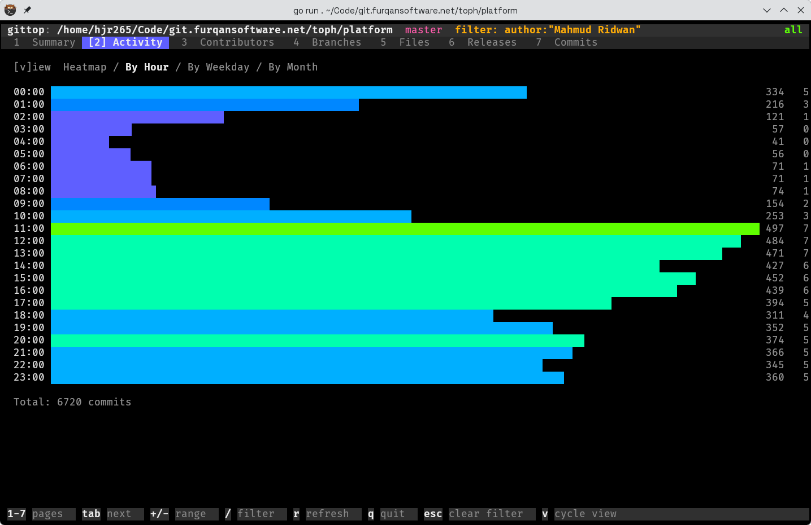
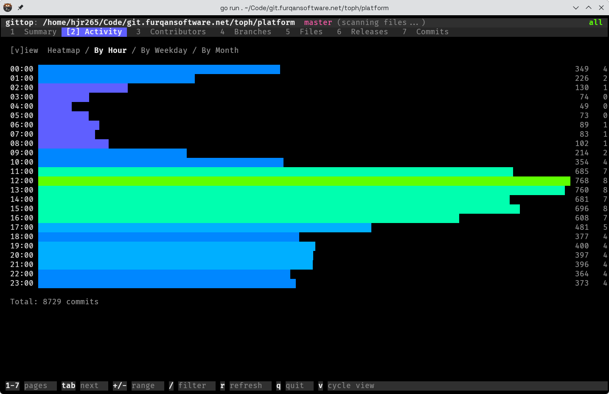
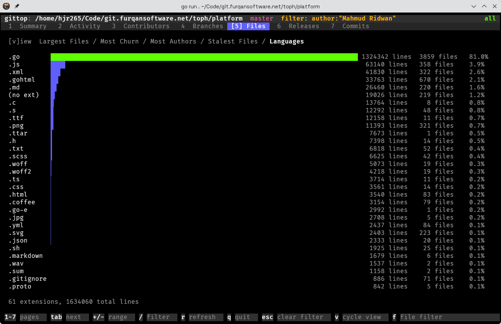
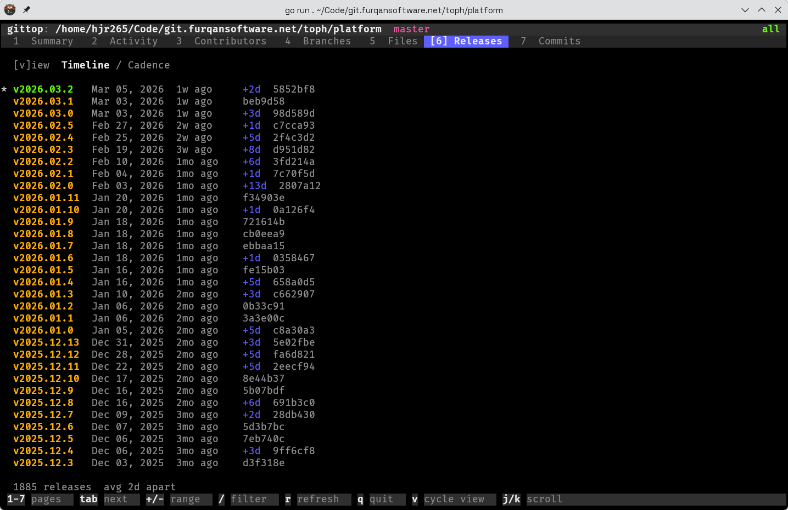
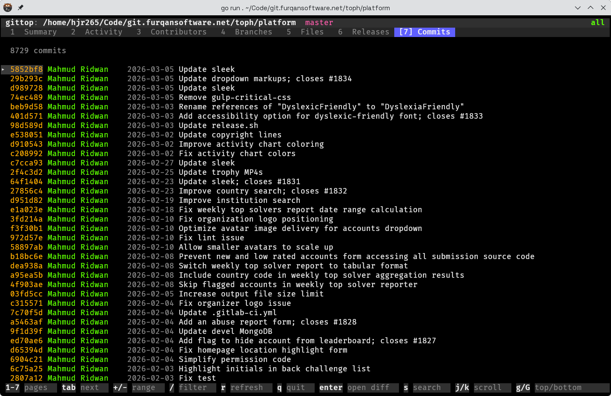

# GitTop

A beautiful terminal UI for visualizing Git repository statistics, inspired by htop/btop.




## Install

```
go install github.com/hjr265/gittop@latest
```

Or build from source:

```
git clone https://github.com/hjr265/gittop.git
cd gittop
go build -o gittop .
```

## Usage

```
gittop              # visualize the current directory's Git repo
gittop /path/to/repo
```

## Tabs

| # | Tab | What it shows |
|---|-----|---------------|
| 1 | **Summary** | KPI cards (total commits, active days, peak day, time span, latest release) + braille area chart |
| 2 | **Activity** | Heatmap, by-hour, by-weekday, by-month distributions |
| 3 | **Contributors** | Split panel: ranked list (left) + per-author detail with cadence, schedule, top files (right) |
| 4 | **Branches** | Sortable table with last commit, author, ahead/behind counts |
| 5 | **Files** | Largest files, most churn, most authors, stalest files, language breakdown |
| 6 | **Releases** | Tag timeline and release cadence chart |
| 7 | **Commits** | Scrollable commit log with diff viewer and search |

## Screenshots

| | |
|---|---|
|  |  |
|  |  |
|  |  |

## Keys

| Key | Action |
|-----|--------|
| `1`–`7` | Switch tab |
| `Tab` / `Shift+Tab` | Next / previous tab |
| `+` / `-` | Widen / narrow date range (3m, 6m, 1y, 2y, 5y, all) |
| `/` | Open global filter (`author:"name"`, `path:*.go`, `branch:main`, `"keyword"`, `and`/`or`/`not`) |
| `Esc` | Clear filter or page-local search |
| `r` | Refresh (re-scan repository) |
| `d` / `w` / `m` / `y` | Chart granularity: daily, weekly, monthly, yearly (Summary) |
| `v` | Cycle sub-views (Activity, Files, Releases) |
| `f` | File path filter (Files tab) |
| `s` / `S` | Sort column / toggle order (Branches); search (Commits) |
| `j` / `k` | Scroll down / up |
| `g` / `G` | Jump to top / bottom |
| `Enter` | Open commit diff (Commits) |
| `q` | Quit |

## Recommended Setup

For best results with the block character bar charts:

- **Terminal:** Kitty, Alacritty, or WezTerm
- **Font:** JetBrains Mono, Iosevka, or Fira Code

Prototyped rapidly with an agentic coding tool.

## License

BSD 3-Clause License. See [LICENSE](LICENSE) for details.
